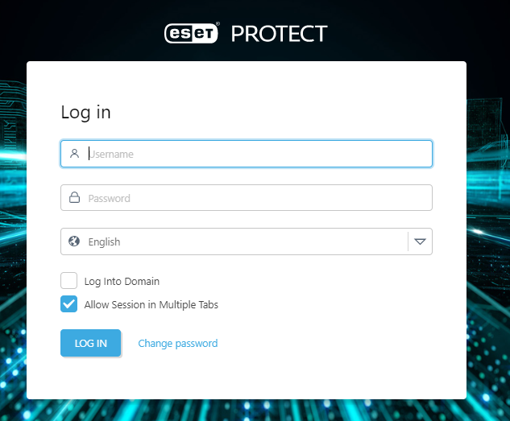

# docker-win-eset-protect
Windows＋DockerのESET PROTECTを構築

## 環境
- OS：Windows 10 Pro 21H2
- RancharDesktop：1.8.1


## Dockerコマンド
``` bash
# Docker-compose実行
$ docker-compose up -d
```

## ブラウザからURL接続、id/passでログイン
```
# URL
http://127.0.0.1:8080

# id / pass
login: Administrator / eraadmin
```




## 参考
- [ESET PROTECT - Server](https://github.com/UnauthorizedAccessBV/ESET-Protect-Docker-Server)
- [ESET PROTECT - Web Console](https://github.com/UnauthorizedAccessBV/ESET-Protect-Docker-Console)
